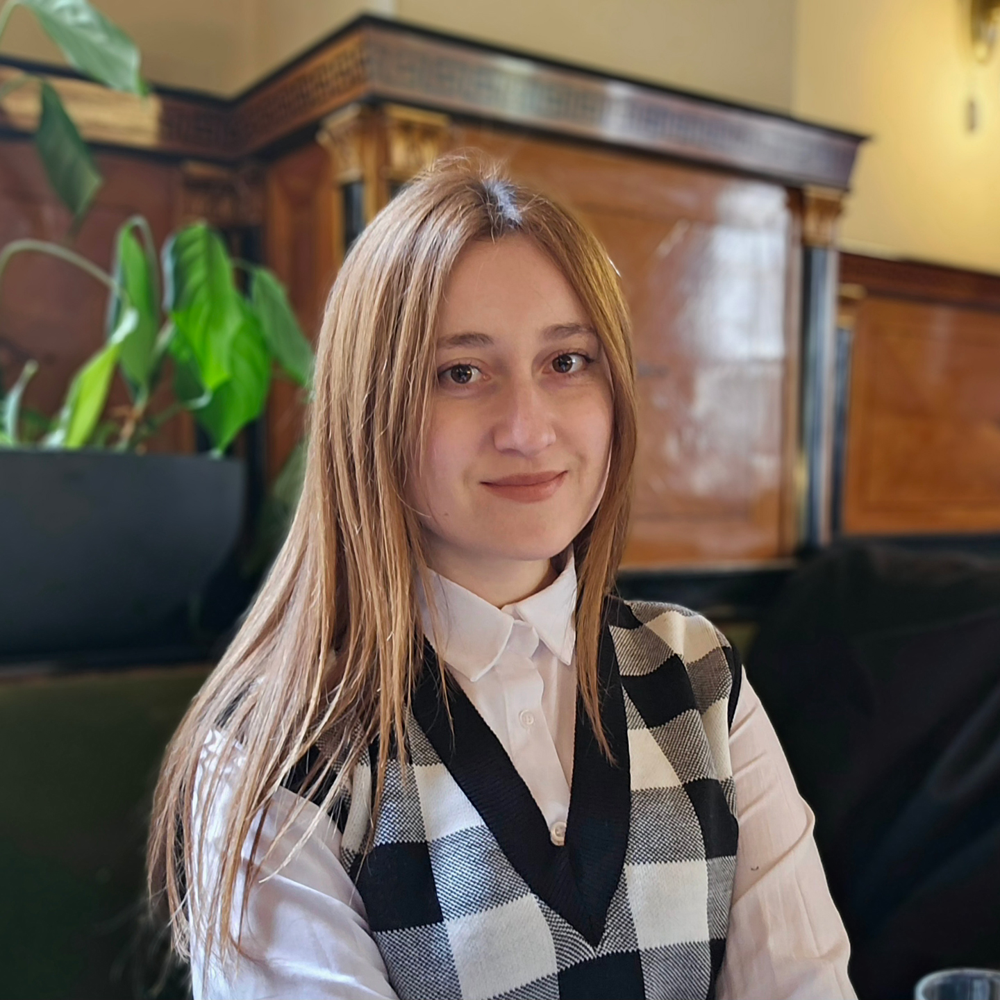

  
  
  # Eriselda's Website
  
  

    A clean, modern, and responsive personal academic website.
  

  

    <a href="https://eriseldagoga.github.io"><strong>View Live Website</strong></a>
  

 

## 🌟 About The Project

Welcome to the repository for my personal website. This project is designed to act as a central hub for my academic and professional life, featuring a modern, minimal link-tree style layout. It provides visitors with quick access to my research publications, teaching materials, and professional profiles.

### ✨ Key Features

- 🌓 **Dynamic Theming:** Seamless support for Light and Dark modes based on user system preferences, along with a manual toggle switch.
- 📱 **Fully Responsive:** Carefully crafted to provide an optimal viewing experience across all screen sizes, from mobile devices to large desktop monitors.
- ⚡ **Lightweight & Fast:** Built cleanly with plain HTML, CSS, and JavaScript, no heavy frontend frameworks required.
- 🎨 **Modern Aesthetics:** Features smooth transitions, elegant typography, and polished UI micro-interactions.

## 🛠️ Built With

* **HTML5** & **CSS** (Utilizing CSS Variables and modern design tokens)
* **JavaScript** (For theme toggling and dynamic UI logic) 

## 📫 Connect With Me

Feel free to reach out or explore my academic work through the links below:

- **Email:** [egoga@epoka.edu.al](mailto:egoga@epoka.edu.al)
- **LinkedIn:** [Eriselda Goga](https://www.linkedin.com/in/eriselda-goga/)
- **Research:** [ResearchGate Profile](https://www.researchgate.net/profile/Eriselda-Goga)

---

  <i>© Eriselda Goga. All Rights Reserved.</i>

